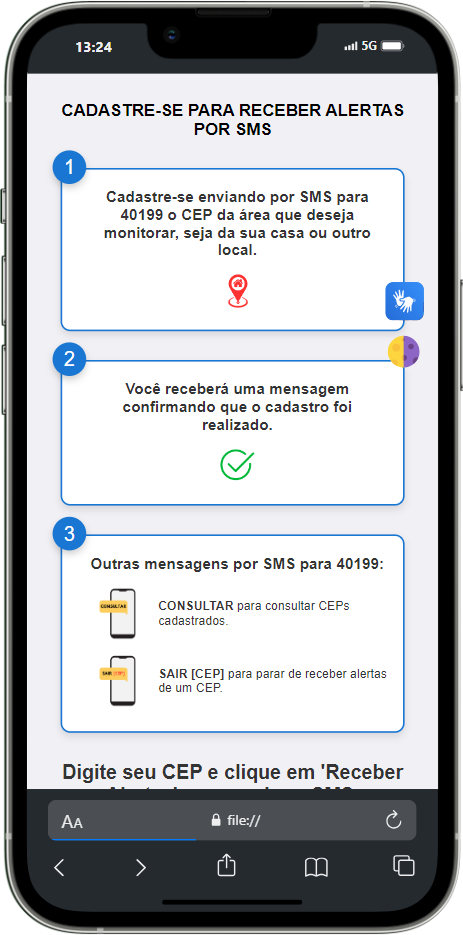
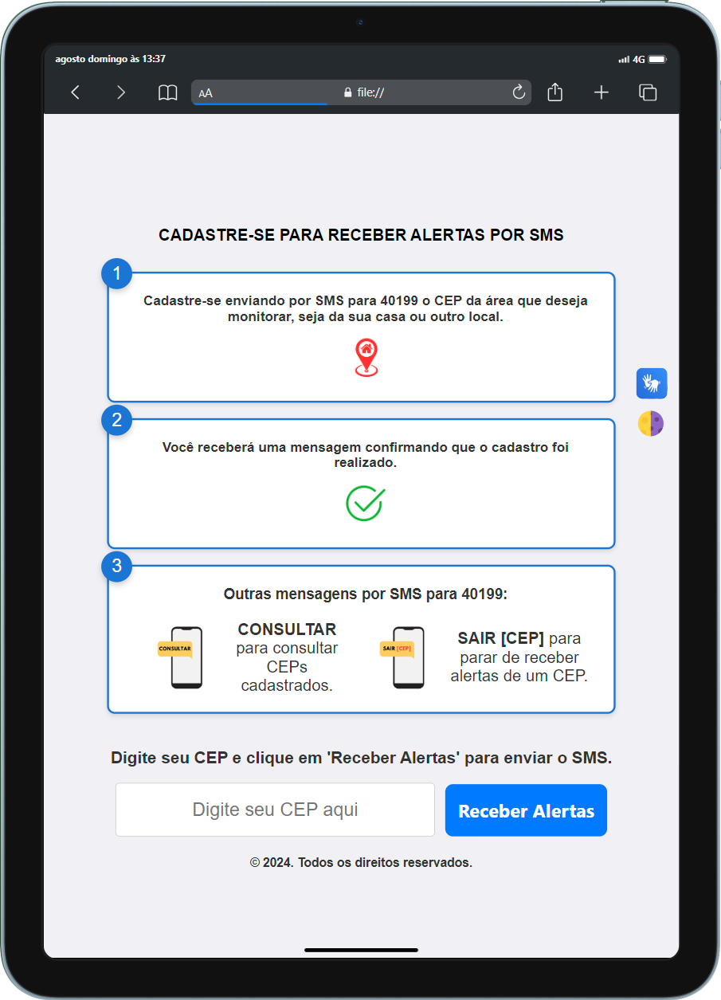

# SMS-Alerta

       

Este projeto é uma página web simples e intuitiva que facilita o envio de SMS para o sistema de alertas da Defesa Civil. A página direciona o usuário ao aplicativo de mensagens SMS com o número de destinatário e o texto da mensagem já configurados, além de fornecer orientações visuais sobre como proceder.

## Funcionalidades

1. **Envio de CEP para monitoramento**: O usuário é guiado para enviar um SMS com o CEP da área que deseja monitorar para o número da Defesa Civil (40199).
2. **Recebimento de confirmação**: Após o envio do SMS, o usuário recebe uma mensagem de confirmação de que o cadastro foi realizado com sucesso.
3. **Consultas e cancelamentos via SMS**: O sistema permite que o usuário consulte os CEPs cadastrados ou cancele alertas para um CEP específico através de comandos enviados via SMS.
4. **Modo Claro e Escuro**: A página permite ao usuário alternar entre o modo claro e escuro, proporcionando uma melhor experiência visual em diferentes condições de iluminação.
5. **Ferramentas de Acessibilidade**: O projeto inclui suporte ao VLibras, oferecendo tradução automática de texto para a Língua Brasileira de Sinais (Libras). Além disso, a página é otimizada para leitores de tela, com descrições alternativas para imagens e uma estrutura semântica que facilita a navegação de usuários com deficiência visual.

Veja abaixo como a página se apresenta em diferentes dispositivos:

<table>
  <tr>
    <td align="center"></td>
    <td align="center"></td>
  </tr>
  <tr>
    <td align="center"></td>
    <td align="center"></td>
  </tr>
</table>

## Tecnologias Utilizadas

- **HTML5**: Estrutura da página.
- **CSS3**: Estilização e layout responsivo.
- **JavaScript**: Funcionalidades interativas, como o redirecionamento para o aplicativo de mensagens SMS.
- **VLibras**: Ferramenta de acessibilidade para tradução de texto em Língua Brasileira de Sinais.
- **Modo Claro/Escuro**: Implementado para melhorar a experiência de uso em diferentes condições de iluminação.

## Como Utilizar

1. **Clone o repositório**:
    ```bash
    git clone https://github.com/iz-brum/sms-alerta.git
    ```
2. **Acesse o diretório do projeto**:
    ```bash
    cd sms-alerta
    ```
3. **Abra o arquivo `index.html` no seu navegador**:
    - Você pode arrastar o arquivo `index.html` para uma janela do navegador ou usar o comando abaixo (em sistemas UNIX):
    ```bash
    xdg-open index.html
    ```
    - Ou, em sistemas Windows:
    ```bash
    start index.html
    ```

## Como Contribuir

Contribuições são bem-vindas! Siga os passos abaixo para enviar melhorias:

1. Faça um **fork** deste repositório.
2. Crie uma **branch** para a sua modificação:
    ```bash
    git checkout -b minha-melhoria
    ```
3. Faça as suas alterações e as commit:
    ```bash
    git commit -m "Descrição clara das alterações feitas"
    ```
4. Envie a sua **branch**:
    ```bash
    git push origin minha-melhoria
    ```
5. Abra um **Pull Request** no GitHub e descreva suas alterações detalhadamente.

## Licença

Este projeto está licenciado sob a Licença MIT. Consulte o arquivo [LICENSE](LICENSE) para mais detalhes.
